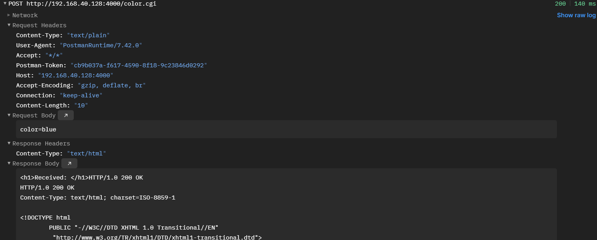

# Tinyhttpd

本仓库对应博客文章（博客内有代码注释）：[https://blog.csdn.net/qq_65795785/article/details/147954232?spm=1001.2014.3001.5501](https://blog.csdn.net/qq_65795785/article/details/147954232?spm=1001.2014.3001.5501)

## 简介

最近通过Tinyhttpd，简单理解​​HTTP服务器的工作原理​​，复习了Socket、多进程、​​管道、重定向等知识​。使用此仓库，建议配合博客文章使用。相较于原来的代码，本仓库没有过多优化，只是做了中文注释，主要也是为了方便大家理解。

## 在Linux中快速开始

### 2.1 下载源码并运行

```bash
$ cd ~ 
$ git clone https://github.com/EZLippi/Tinyhttpd.git
$ cd ./Tinyhttpd
$ make
$ ./httpd 
```

程序若正常运行则出现如下提示：

```txt
httpd running on port 4000
```

如果端口创建失败，可以进入httpd.c的main函数内更改端口。


### 2.2 基于CGI脚本的动态网页

在浏览器中输入地址`http://localhost:4000`,


在上图输入框输入red、green等单词，即可得到对应的颜色。如下图：

**颜色未响应是为什么？**

（1）原因1：**可能是cgi的脚本文件有问题**。

使用`cat ./htdocs/color.cgi`得到如下结果：
```bash
#!/usr/local/bin/perl -Tw
use strict;
use CGI;
my($cgi) = new CGI;
#……
```

此处将`#!/usr/local/bin/perl`改为``#!/usr/bin/perl``，然后重新运行项目即可。

（2）原因2：**perl、CGI模块未安装**。

检验的办法是否是perl的问题，可以运行`./color.cgi`，如果正常输出内容，则说明perl没有问题。否则就需要安装，安装如下：

```bash
# 检查 Perl 是否安装。
perl -v
# 接着安装 CGI 模块
sudo apt install libcgi-pm-perl
```

### 2.3 运行本地自定义网页

（1）创建`htdocs/test.html`文件，内容请自定义。

（2）在`htdocs/index.html`的body标签添加`<a href="test.html">访问自定义页面</a>`,即上面网页的链接路径：
```html
<HTML>
<TITLE>Index</TITLE>
<BODY>
	#……
    <p>这是一个简单的自定义网页示例。</p>
    <a href="test.html">访问自定义页面</a>
	#……
</BODY>
</HTML>
```

（3）最终效果类似下图：

点击后跳转页面，此时就不是在执行CGI脚本了。


## 数据传输验证

**1.在Windows上，IP地址不能使用127.0.0.1，需要使用虚拟机的IP地址。**

`make`后，运行`./httpd`，然后使用postman工具进行测试。如下为测试示例：

（1）GIT请求。

```html
请求方法：GET
请求URL：http://192.168.40.128:4000/test.html
请求头（Header）：无
请求体(boyd)：无
```

返回结果：


可以看到返回的，返回体中是test.html这个网页的代码（test.html的数据），这就是为什么在浏览器时输入`http://192.168.40.128:4000/test.html`路径时，出现的是`test.html`网页。

（2）POST请求。

```html
请求方法：POST
请求URL：http://192.168.40.128:4000
请求头（Header）：
    Content-Type: application/x-www-form-urlencoded #对于本次测试可以不写
    Content-Length: 10       #对于本次测试可以不写
请求体(boyd)：
    color=blue #需求：返回的页面是蓝色
```

返回结果：


仔细看途中的返回信息，可以发现返回的数据color=bule，也就是说明我们需求得到了服务器正确响应。这样一来我们拿到的网页就是蓝色的。

**2.在Ubuntu上，IP地址使用127.0.0.1。**

```bash
curl -X POST -d "color=blue" http://127.0.0.1:4000/color.cgi
```

返回结果：

```bash
    #这部分就是我们自己添加的输出代码
    <h1>Received: </h1>HTTP/1.0 200 OK
    HTTP/1.0 200 OK
    Content-Type: text/html; charset=ISO-8859-1

    # 这部分是源代码CGI脚本输出的内容
    # ……
    <html xmlns="http://www.w3.org/1999/xhtml" lang="en-US" xml:lang="en-US">
    <head>
    <title>BLUE</title>
    <meta http-equiv="Content-Type" content="text/html; charset=iso-8859-1" />
    </head>
    <body bgcolor="blue"> #此处为输入的blue
    <h1>This is blue</h1>
    </body>
    </html>
```

```bash
curl -X GET  http://127.0.0.1:4000/test.html
```

其返回结果就是test.html的内容。此处就不展示了。更多内容看博客吧！

[https://blog.csdn.net/qq_65795785/article/details/147954232?spm=1001.2014.3001.5501](https://blog.csdn.net/qq_65795785/article/details/147954232?spm=1001.2014.3001.5501)